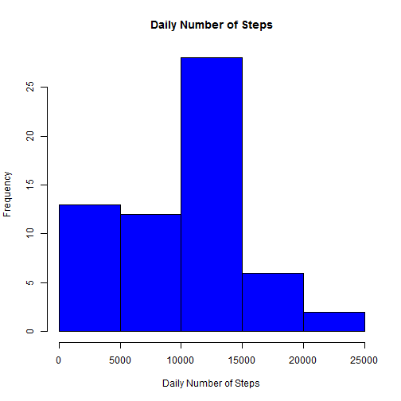
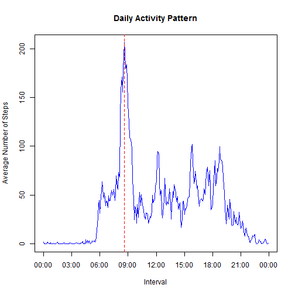
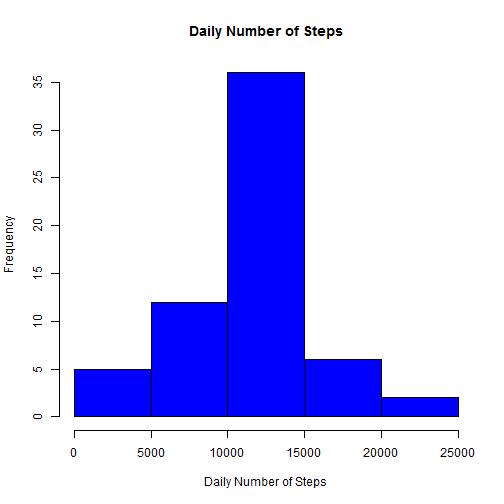
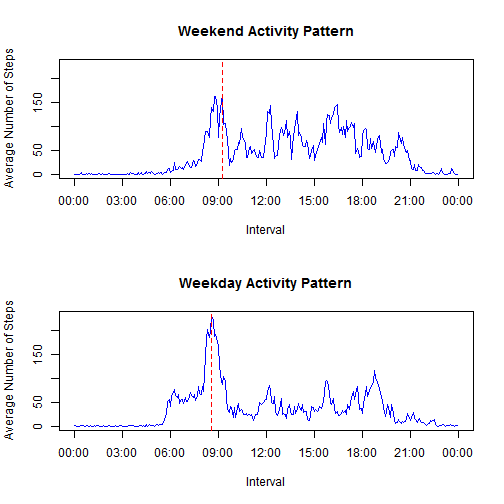

Reproducible Reseach - Peer Assignment #1
========================================================

##  Load and Process Data


```r
# Load data into R.  Set working directory
setwd("C:/Users/mmacrae/Coursera/5. Reproducible Research/Assignment #1")

## Load activity data from CSV file into data frame.
activity <- read.csv("activity.csv")

# Processing code converts measured data to analytic data.  Transform date
# from factor to date variable.
activity <- transform(activity, date = as.Date(date))

## Combine date and time into a POSIXlt object in the data frame.
activity$datetime <- strptime(paste(format(activity$date, "%Y-%m-%s"), sprintf("%04d", 
    activity$interval)), "%Y-%m-%s %H%M")
```


##  Raw Data
### Calculate Daily Number of Steps


```r
# What is the mean total number of steps taken per day?  Summarize number of
# steps per day.
steps.per.day <- with(activity, tapply(steps, as.Date(date), sum, na.rm = TRUE))

## Plot histogram of the total number of steps taken each day.
hist(steps.per.day, col = "blue", main = "Daily Number of Steps", xlab = "Daily Number of Steps")
```

 

```r

## Calculate and report the mean and median total number of steps taken per
## day.
mean.raw <- mean(steps.per.day)
median.raw <- median(steps.per.day)
```


The mean number of steps taken per day is 9354.2295.
The median number of steps taken per day is 10395.

### Average Daily Pattern


```r
## Calculate average number of steps taken by interval.
steps.avg <- with(activity, tapply(steps, interval, mean, na.rm = TRUE))
steps.avg.time <- as.POSIXct(strptime(sprintf("%04d", as.numeric(names(steps.avg))), 
    "%H%M"))

## Plot time-series graph of the average number of steps taken in each
## 5-minute interval.
plot(steps.avg.time, steps.avg, type = "l", col = "blue", main = "Daily Activity Pattern", 
    xaxt = "n", xlab = "Interval", ylab = "Average Number of Steps")
axis.intervals <- seq(from = strptime("0000", "%H%M"), to = strptime("2400", 
    "%H%M"), length.out = 9)
axis(side = 1, at = c(axis.intervals), labels = format(axis.intervals, format = "%H:%M"))

## Which five-minute interval, on average across all the days in the dataset,
## contains the maximum number of steps?
interval.max <- strptime(sprintf("%04d", as.numeric(names(which.max(steps.avg)))), 
    "%H%M")
interval.max.text <- with(interval.max, paste0(sprintf("%02d", hour), ":", sprintf("%02d", 
    min)))
abline(v = as.POSIXct(interval.max), lty = 2, col = "red")
```

 


The maximum number of steps, on average across all days in the dataset, occurs at 08:35.

##  Clean Data
### Fill Missing Values


```r
n.missing <- sum(is.na(activity$steps))
```


There are 2304 missing values in the raw data. We fill each missing value with the average number of steps taken in that hour across all days.


```r
## Copy activity data set to clean data step.
activity.clean <- activity

## Fill in all missing values with average of the five-minute interval.
activity.clean$steps[is.na(activity.clean$steps)] <- steps.avg[match(activity$interval[is.na(activity$steps)], 
    names(steps.avg))]
```


### Calculate Daily Number of Steps


```r
## Plot histogram of the total number of steps taken each day.
steps.per.day.clean <- with(activity.clean, tapply(steps, as.Date(date), sum, 
    na.rm = TRUE))
hist(steps.per.day.clean, col = "blue", main = "Daily Number of Steps", xlab = "Daily Number of Steps")
```

 

```r

## Calculate and report the mean and median total number of steps taken per
## day.
mean.clean <- mean(steps.per.day.clean)
median.clean <- median(steps.per.day.clean)
```


The mean number of steps taken per day is 10766.
The median number of steps taken per day is 10766.

##  Differences in Activity Patterns Between Weekdays and Weekends


```r
## The $wday element in the POSITlt object returns an integer representing
## the day of week.  Define a vector of string objects indexed to $wday to
## group days into weekends and weekdays.  Sunday corresponds to one, and
## Saturday corresponds with seven.  Note: This simplified analysis fails to
## capture holidays.
wday.group <- factor(c("Weekend", rep("Weekday", 5), "Weekend"))

## In the $wday element of a POSIXlt object, Sunday corresponds to zero and
## Saturday corresponds with six.  Introduce a +1 adder to convert the $wday
## object to index the wday.group array.
activity.clean$wday <- wday.group[as.POSIXlt(activity.clean$datetime)$wday + 
    1]

## Calculate the average steps by weekday/end and time interval.
steps.avg.by.wday <- with(activity.clean, sapply(split(steps, list(wday, interval)), 
    mean))
x <- data.frame(steps.avg.by.wday, t(matrix(unlist(strsplit(names(steps.avg.by.wday), 
    "[.]")), nrow = 2)))
dimnames(x)[[2]] <- c("steps.avg", "wday", "interval")
x <- transform(x, interval = as.POSIXct(strptime(sprintf("%04d", as.numeric(as.character(interval))), 
    "%H%M")))

## Prepare 2x1 grid of plots.
par(mfcol = c(2, 1))
axis.intervals <- seq(from = strptime("0000", "%H%M"), to = strptime("2400", 
    "%H%M"), length.out = 9)

# Separate x into distinct weekend and weekday data frames.
weekend <- x[x$wday == "Weekend", ]
weekday <- x[x$wday == "Weekday", ]

# Plot weekend time-series step data.
plot(as.POSIXct(weekend$interval), as.numeric(weekend$steps.avg), type = "l", 
    col = "blue", main = "Weekend Activity Pattern", xaxt = "n", xlab = "Interval", 
    ylab = "Average Number of Steps", xlim = c(min(axis.intervals), max(axis.intervals)), 
    ylim = c(0, max(x$steps.avg)))
axis(side = 1, at = c(axis.intervals), labels = format(axis.intervals, format = "%H:%M"))
abline(v = as.POSIXct(weekend[which.max(weekend$steps.avg), ]$interval), lty = 2, 
    col = "red")

## Plot weekday time-series step data.
plot(as.POSIXct(weekday$interval), as.numeric(weekday$steps.avg), type = "l", 
    col = "blue", main = "Weekday Activity Pattern", xaxt = "n", xlab = "Interval", 
    ylab = "Average Number of Steps", xlim = c(min(axis.intervals), max(axis.intervals)), 
    ylim = c(0, max(x$steps.avg)))
axis(side = 1, at = c(axis.intervals), labels = format(axis.intervals, format = "%H:%M"))
abline(v = as.POSIXct(weekday[which.max(weekday$steps.avg), ]$interval), lty = 2, 
    col = "red")
```

 

